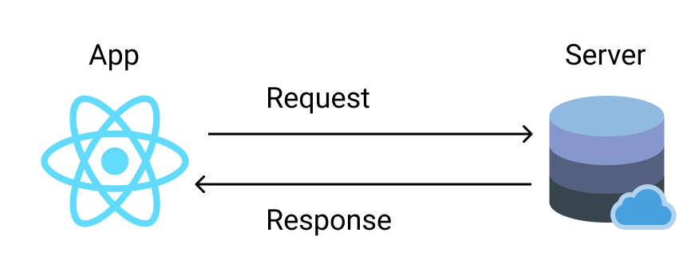
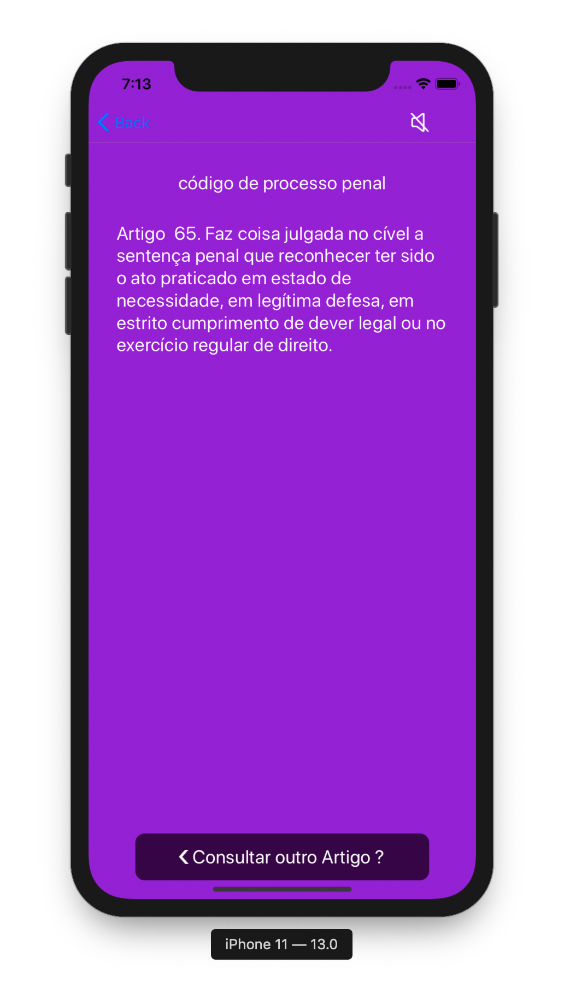
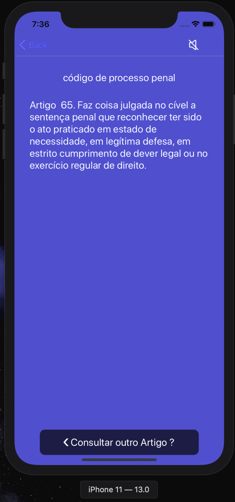
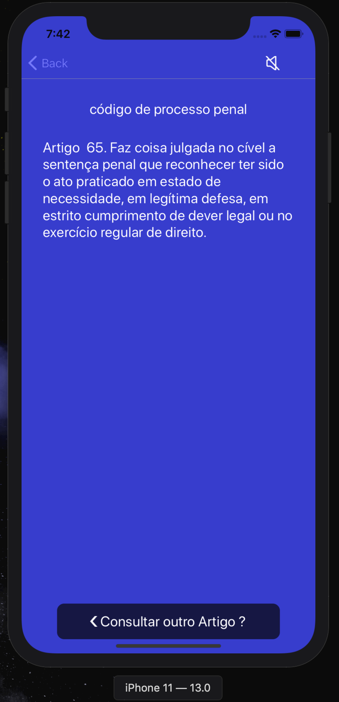
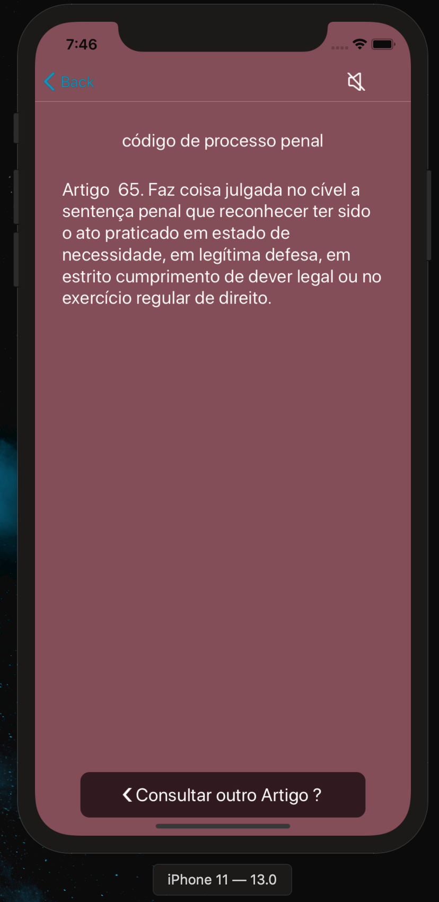
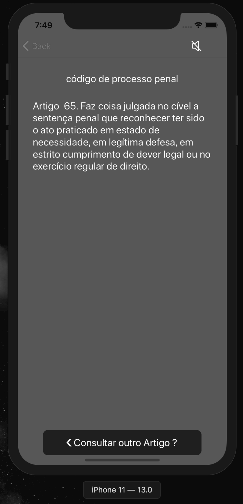

export { default as theme } from './theme'
import Layout from './ImageLayout'

# Assistente Virtual - ISA 

---

# Luis Filipe Alves de Oliveira

# Desenvolvedor React Native - Fintech Stratum

 Github: www.github.com/lfoliveir4

 Linkedin: www.linkedin.com/in/lf-oliveira/

---

# Concept

O ISA foi um projeto iniciado pelo ex-aluno da Faculdade Barretos, Adriano Robson de Andrade. 

Devido a grande importancia do projeto e usabilidade, decidi fazer a continuação do mesmo readaptando não só para o foco principal que seria deficientes visuais, mas para pessoas com deficiência ou não. 

---

# Overview

- Iterativo, incremental e evolutivo.

- Comunicação eficiente para com qualquer tipo de usuário.

- Foco na qualidade e melhor experiência de UX. 

---

# Principles    

- Satisfação dos usuários. 

- Facilidade de uso.

- Design Iterativo. 

- Consultas rápidas e objetivas. 

- A construção de um software valioso. 

---

# Data Fetching Law ISA

---

# Colors ISA

export default Layout

Visão normal:

---

export default Layout

Visão Deuteranopia:

---

export default Layout

Visão Protanopia:

---

export default Layout

Visão Tritanopia:

---

export default Layout

Visão Grayscale:

---

# Prototype

---

Repository

# www.github.com/lfoliveir4/assistant-isa

---

# Thanks !

